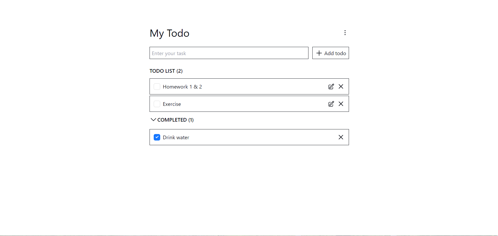
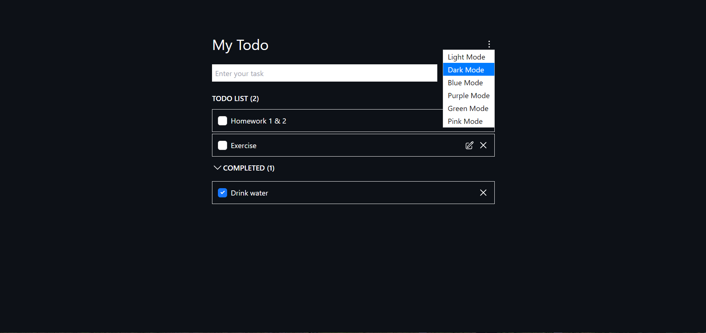

# Todo App with ReactJS 
## Description
This is a simple todo app created with ReactJS. It allows users to add, delete and mark todos as completed. The app is responsive and works well on mobile devices.

## How to run the app
1. Clone the repository
2. Run `npm install` to install the dependencies
3. Run `npm start` to start the development server
4. Open `http://localhost:3000` in your browser

## Features
- Add a new todo
- Delete a todo
- Edit a todo
- Mark a todo as completed
- Change the theme of the app
- Save the todos in the local storage

## Technologies
- ReactJS
- CSS

## Demo
You can view a live demo of the app [My Todo](https://todo-app-reactjs-2021.netlify.app/)

## Screenshots
### Main UI 
 

### Change theme

